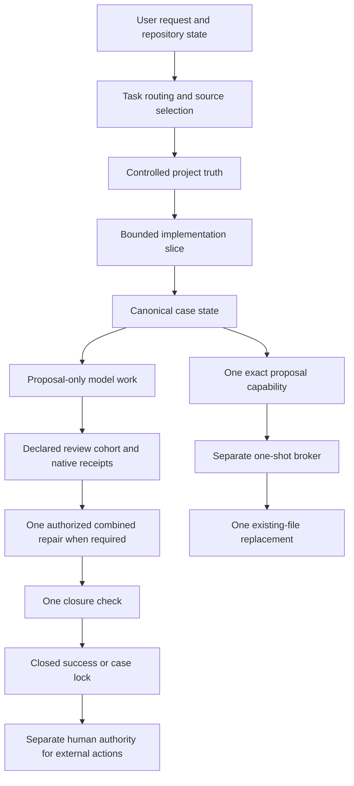

# Codex Coding OS

[](https://github.com/AymanShams/codex-coding-os/actions/workflows/validate.yml)
[](LICENSE.md)
[](https://github.com/AymanShams/codex-coding-os/stargazers)
[](https://github.com/AymanShams/codex-coding-os/commits/main)

Codex Coding OS is an installable workflow and runtime-control pack for OpenAI
Codex. It turns a vague request into controlled project truth, a bounded unit of
work, reviewable evidence, and an honest completion decision.

The pack has two layers:

1. A practical development workflow built from skills, templates, repository
   instructions, routing, session continuity, worktree lanes, and validation.
2. An advanced finite automation runtime that keeps one implementation, one
   declared review cohort, one combined repair, and one closure check bound to a
   canonical case.

The second layer does not give models general write authority. Model processes
produce proposals and evidence. A deterministic, separate process can consume
one predeclared capability for one exact existing-file replacement.

Codex Coding OS is an independent open-source project. It is not affiliated with,
endorsed by, or sponsored by OpenAI.

[Five-minute setup](docs/getting-started.md) | [Philosophy](docs/philosophy.md) |
[Case-state contract](docs/case-state-contract.md) | [Full skill inventory](docs/full-skill-inventory.md) |
[Changelog](CHANGELOG.md)

## Current source status

This README describes repository `main` through pull request 31.

| Item | Current state |
|---|---|
| Package metadata | `pack.manifest.json#version` is `0.9.0` with `public-release` metadata |
| Functional baseline | [`8a82a23`](https://github.com/AymanShams/codex-coding-os/commit/8a82a23cbf8d105a4142b5a2157d0dfc84cb90b7), the merge of pull request 31 |
| Latest published GitHub release | `v0.8.4` |
| Source status | `main` contains merged 0.9 work and the post-0.9 runtime closeout recorded under `Unreleased` |
| Pull requests covered | 30 pull requests, numbered 2 through 31 |
| Pull request states | 26 merged, 2 closed without merge, 2 still open |
| Bundled skills | 45 |
| Tracked files | 541 |
| Install bundle entries | 537 |
| Advanced runtime platform | Windows |

The published `v0.8.4` archive does not contain every feature documented for
current `main`. Until a newer release is published, install `main` only from a
clean source checkout at an exact commit and verify the bundle manifest first.

## Contents

- [What this project is](#what-this-project-is)
- [Operating philosophy](#operating-philosophy)
- [Source-of-truth hierarchy](#source-of-truth-hierarchy)
- [System model](#system-model)
- [Operating modes](#operating-modes)
- [Finite case lifecycle](#finite-case-lifecycle)
- [Feature specification](#feature-specification)
- [Repository architecture](#repository-architecture)
- [Package inventory](#package-inventory)
- [Installation](#installation)
- [First project workflow](#first-project-workflow)
- [Command reference](#command-reference)
- [Platform and validation status](#platform-and-validation-status)
- [Pull request evolution](#pull-request-evolution)
- [Release evolution](#release-evolution)
- [Boundaries and non-goals](#boundaries-and-non-goals)
- [Glossary](#glossary)

## What this project is

Codex Coding OS is a reusable control layer for AI-assisted software work. It is
not an application framework and it does not generate one fixed project shape.
It installs portable capabilities that help Codex decide what kind of work is
being requested, identify the controlling sources, resolve material decisions,
plan the smallest useful slice, execute within explicit boundaries, and verify
the result.

The pack is useful in two very different situations.

For ordinary work, it provides disciplined project setup and implementation
without forcing a heavy process onto a tiny change.

For explicitly approved automation, it adds a canonical state engine and a narrow
runtime action boundary. That boundary exists because prompts, role labels, thread
identifiers, and model-generated approval messages are evidence, not write
authority.

The repository itself contains reusable workflow assets. Product source code,
generated project documents, deployment configuration, and project-specific state
belong in the target project repository.

## Operating philosophy

### Start from controlled sources

The system first determines which sources control the work, which sources are
reference only, and which decisions remain unresolved. A fluent answer is not a
substitute for source fidelity.

### Specifications control the next action

Project briefs, requirements, technical designs, architecture decision records,
and repository instructions make work inspectable. They are current operating
truth, not proof that every decision is permanently correct.

### Use the lightest process that fits the risk

A small, reversible, already specified edit should use a narrow skill and normal
repository checks. New products, unclear repositories, shared behavior, or
material architecture changes need stronger source and validation gates.

### Prefer procedural skills to roleplay

A useful skill defines when it applies, its required inputs, source hierarchy,
steps, outputs, stop conditions, and validation. A persona prompt may change tone,
but it cannot replace an operational contract.

### Keep work bounded

One accountable execution context owns one bounded slice. Parallel lanes are
available only when their files, baseline, validation, and stop conditions are
declared and the user approves the lane plan.

### Treat routing as advice, not authority

The router can identify likely primary and supporting capability families. It
cannot override the user, repository instructions, manifests, the current Git
state, or a canonical case decision.

### Treat validation as part of completion

Code or documentation output is not completion by itself. Completion requires
evidence tied to the intended behavior, plus a clear statement of what was not
verified.

### Preserve continuity outside the chat

Important decisions, current state, active slice, validation evidence, and
handoffs belong in inspectable files. A new chat cannot silently reinterpret an
incomplete workflow as permission to continue.

### Preserve automation, but make it finite

Automation is not disabled globally. It is enabled only inside a declared run
envelope bound to one canonical case. The case has fixed limits and cannot be
reset by a new chat, branch, worktree, pull request, or child session.

### Put exact action authority outside model processes

In the controlled runtime path, models remain proposal-only. One actorless,
single-use capability binds the exact repository state, file, proposal bytes,
broker identity, and expiry before a separate process can replace anything.

### Keep failures case-scoped

A failed review, failed closure, or locked case blocks that exact case and its
colliding bindings. It does not freeze unrelated work in the same repository.

## Source-of-truth hierarchy

The README is the public human-readable source of truth. Machine decisions defer
to the following files in this order.

| Question | Authoritative source |
|---|---|
| Package version, required files, support inventory, and bundled skills | `pack.manifest.json` |
| Exact installable files and aggregate digest | `install-bundle.manifest.json` |
| Case record structure | `case-state.schema.json` |
| Case transitions and action decisions | `scripts/agent/case_state.py` |
| Human-readable lifecycle contract | `docs/case-state-contract.md` |
| Current production action decision | `docs/architecture/adr/0002-artifact-authorized-one-shot-action.md` |
| Historical v1 runtime recovery interpretation | `docs/architecture/adr/0001-brokered-runtime-action-boundary.md` |
| Typed validation evidence structure | `validation-evidence.schema.json` |
| Bundled skill inventory | `docs/full-skill-inventory.md` and `pack.manifest.json` |
| Release history | `CHANGELOG.md` |
| Published release artifacts | GitHub Releases |

ADR 0002 supersedes ADR 0001 for new production action authorization. New v1
runtime grants are disabled. Existing v1 records remain readable only for bounded
terminal recovery.

If prose conflicts with the canonical engine or a machine manifest, the machine
source wins and the prose must be corrected.

## System model



The normal workflow can stop after a bounded implementation and proportionate
validation. The case engine and broker are advanced components for an explicitly
approved automation run. They are not required for every small edit.

## Operating modes

### Lightweight repository work

Use this for a small, reversible, already specified change.

1. Read repository instructions and the target files.
2. Select the narrowest matching skill.
3. Make the minimum change.
4. Review the actual diff.
5. Run proportionate validation.

### Spec-first project workflow

Use this for a new product, an unclear existing repository, or a material change.

1. Inventory sources and current repository state.
2. Resolve material questions before implementation.
3. Create the workflow manifest and controlled project documents.
4. Create the technical design and any required decision records.
5. Add repository instructions, current state, active-slice manifest, and session
   continuity.
6. Approve one bounded implementation slice.
7. Implement, review, validate, and record the next exact action.

### Finite automation mode

Use this only after explicit approval of the repository, objective, run envelope,
case ID, branch or worktree plan, child limits, review expectations, publication
authority, and stop conditions.

The parent is administrative. It may inspect, assign, monitor, reconcile, and
report. Implementation, review, repair, closure, and publication are separate
bounded roles whose actions are checked against the canonical case.

## Finite case lifecycle

The canonical lifecycle is:

```text
REGISTERED
  -> IMPLEMENTING
  -> CANDIDATE_FROZEN
  -> REVIEW_COLLECTING
  -> FINDINGS_FROZEN
       -> CLOSED_SUCCESS
       -> REPAIR_AUTHORIZED
          -> REPAIR_COMPLETE
          -> CLOSURE_PREFLIGHT
          -> CLOSURE_CHECK
             -> CLOSED_SUCCESS
             -> CASE_LOCKED
```

`CONTROL_FAILURE` is an operational state. It preserves the prior state for one
identical retry. A repeated control failure locks only the affected case.

### Fixed case limits

| Resource | Maximum per case |
|---|---:|
| Implementation generations | 1 |
| Declared review cohorts | 1 |
| Combined repairs | 1 |
| Closure checks | 1 |
| Identical operational retries | 1 |
| New production action grants | 1 |

Every mutation requires a unique request identifier, the exact expected revision,
and a stable payload. An identical retry is idempotent. Reusing the request ID with
different data or using a stale revision fails without changing state.

### Exact bindings

A case can bind repository URLs, branches, worktrees, pull requests, threads, and
universal bundle identifiers. Repository association is nonexclusive. Exact branch,
worktree, pull request, thread, or universal-bundle collisions are exclusive.

This distinction allows unrelated work in the same repository while preventing a
new branch or chat from masquerading as a reset of the same case.

## Feature specification

### Task and capability routing

- Five-layer classification: container, action, domain, validation need, and
  authority.
- Deterministic route hypotheses with recorded route-tree and algorithm-step
  metadata.
- Active installed capabilities are eligible for automatic ownership.
- Inactive, candidate, project-local, remote, and reference-only entries are
  gated support only.
- The optional prompt hook fails open and remains advisory.
- Generic words such as `next` cannot select a framework by themselves.
- Source and connector tools provide evidence. They do not become workflow owners.

Primary files:

- `.agents/skills/catalogue-router/`
- `hooks/capability-router/`
- `capability-index/`
- `codex-capabilities/`

### Project definition and durable context

- Project intake and consolidated material-decision questions.
- Project brief, product requirements, app flow, technical stack, frontend and
  backend guidance, implementation plan, and technical design templates.
- Architecture decision record template.
- Repository and scoped `AGENTS.md` templates.
- Live current-state and active-slice controls for generated projects.
- Persistent handoff templates and reentry summaries.
- Product-repository and Coding OS source-repository profiles.
- Fail-closed profile detection when a repository is partial or malformed.

### Bounded implementation and worktree lanes

- One bounded implementation slice at a time.
- Manual sequential sessions as the default automation shape.
- Explicit opt-in parent orchestration for approved run envelopes.
- Parallel worktree evaluation, planning, creation, validation, status, close, and
  cleanup commands.
- Per-lane baseline, allowed files, forbidden files, validation commands, review
  requirement, and stop conditions.
- Optional commit and push hooks that validate an active lane contract.
- Fresh-context detached review worktrees for clean commits.

### Declared review cohorts

Review starts by freezing one `ccos-review-cohort-v2` declaration. Every required
assignment binds:

- reviewer ID
- native child and parent thread identities
- canonical agent path
- repository and exact reviewed head
- exact Git snapshot
- exact review scope and scope digest

The completion mutation accepts only the frozen reviewer ID. The verifier derives
`ccos-review-completion-v2` from the reviewer's native rollout, ordered task start
and completion, and exact final payload. Caller-supplied role, thread, completion
state, timestamp, findings, or digest cannot substitute.

Findings cannot freeze, closure cannot start, and publication cannot become
eligible until every required reviewer has a verified `COMPLETED` receipt.

The finding classes are:

- `CURRENT_BLOCKER`
- `NON_BLOCKING`
- `INVALID_OR_STALE`
- `REDESIGN_REQUIRED`
- `CONTROL_FAILURE`

Only the exact frozen `CURRENT_BLOCKER` set can authorize the single combined
repair. The closure check can resolve only those identifiers. It cannot become a
second general review.

Persisted v1 receipts are not silently upgraded. The bounded attestation command
requires a later v2 restatement from the same native rollout and preserves the
original v1 receipt digest.

### Canonical Git snapshots

`ccos-git-snapshot-v1` hashes committed Git objects, not mutable worktree bytes.
It requires:

- an exact 40-character head
- a clean worktree before and after enumeration
- regular Git blob modes only
- normalized, safe repository-relative paths
- stable Git head throughout the operation

Ignored cache and generated support files do not change a frozen candidate.
Dirty tracked files and nonignored untracked files fail closed.

### One-shot runtime action

The current production protocol is `ccos-proposal-action-grant-v2`.

| Field | Specification |
|---|---|
| Authorized operation | `replace_existing_file_v1` |
| Target | One already existing tracked file |
| Payload | Exact bytes of one predeclared proposal artifact |
| Maximum replacement size | 8 MiB |
| Maximum grant lifetime | 15 minutes |
| Grant lifecycle | `ARMED -> ISSUED -> CLAIMED -> COMPLETED` or `FAILED` |
| Pre-issuance terminal path | `ARMED -> CANCELLED` |
| Write authority | First successful non-idempotent claim only |
| Replay | Denied |
| Runtime platform | Windows |

The grant is actorless. It does not trust App Server identity, model role, thread,
turn, task path, proposal-producing process, or approval text.

Before issuance, the record binds the exact case and revision, repository, branch,
worktree, base head, existing target path, baseline digest, proposal path, proposal
digest, byte count, replacement digest, broker identity, evidence mode, source
pins, and expiry.

At execution, the separate broker independently rechecks every binding, claims the
grant, atomically replaces the target, verifies the final digest and changed-path
set, records completion, and denies a second execution.

The capability does not authorize a command, patch interpreter, path choice at
runtime, file creation, deletion, rename, multi-file change, commit, push, pull
request, release, or universal synchronization.

### Proposal-only App Server controller

The controlled App Server path runs parent and child model work as read-only
proposal workers. It uses no dynamic tools, MCP servers, hooks, inherited tool
environment, or native mutation approval. Native thread identities corroborate
who produced evidence, but they do not grant the write.

The controller accepts one strict implementation proposal and emits deterministic
inputs. The supervisor coordinates canonical state and invokes the fixed broker.

### Restart and recovery behavior

- `ARMED` recovery cancels the arm, restores or proves the original access state,
  and locks the case.
- `CLAIMED` recovery uses the protected journal and exact baseline.
- An already exact replacement can complete without another write.
- Any third file state rolls back to the sealed baseline and locks the case.
- A completed or failed grant cannot return to `ISSUED`.
- A missing context, mismatched binding, stale revision, or replay consumes the
  grant without creating another write opportunity.

### Erroneous terminal-closure quarantine

`quarantine-terminal` is the only correction for a proven erroneous
`CLOSED_SUCCESS` record. It requires the exact case ID, expected state, revision,
case-record SHA-256, one-use request ID, named human authority, and fixed evidence
reason.

The operation creates an exact protected store backup, writes hash-chained
`PREPARED` and `COMMITTED` records, and moves only that case to `CASE_LOCKED`. It
does not reopen the case, reset counters, authorize repair, or authorize
publication.

### Transactional installation and removal

PowerShell and Bash are thin adapters around one standard-library Python state
machine in `scripts/install_transaction.py`.

The transaction protocol is `ccos-install-transaction-v1`. A normal successful
install advances through:

```text
LOCK_ACQUIRED
PREFLIGHT_VERIFIED
SOURCE_VERIFIED
STAGE_VERIFIED
PROMOTION_PREPARED
PROMOTING
LIVE_TARGETS_VERIFIED
CURRENT_POINTER_COMMITTED
CLEANUP_COMPLETE
```

The installer provides:

- exact bundle inventory and aggregate verification
- optional exact source-commit binding
- exclusive transaction locking
- durable journals and finite recovery
- staged promotion and post-promotion verification
- version 3 install provenance
- idempotent reinstall and matching uninstall
- preservation of non-managed content
- one bounded migration path for a verified legacy nested-skills layout
- optional capability-index refresh

Normal archive and source installs do not modify global Codex policy files.
Universal policy synchronization is a separate source-checkout operation that
requires an exact bundle, exact commit, closed canonical case, bound universal
bundle, and separate authority record.

### Typed validation evidence

`scripts/agent/validation_evidence.py` validates inert JSON evidence against the
local repository identity, full Git head, and worktree state. It does not execute
the recorded commands and it does not grant a lifecycle transition.

### Packaging and release mechanics

- `pack.manifest.json#version` is the sole package version.
- `install-bundle.manifest.json` records every installable file and the aggregate
  digest.
- Packaging from Git requires tracked files to match `HEAD` and archives committed
  content only.
- The package validator checks required files, manifest structure, skill
  frontmatter, internal links, release metadata, and generated archive contents.
- External skill sources stay pinned, reference-only, or explicitly gated.

## Repository architecture

| Layer | Primary files | Responsibility |
|---|---|---|
| Public entrypoint | `README.md`, `docs/getting-started.md` | Explain the current system and first run |
| Machine inventory | `pack.manifest.json`, `pack.schema.json` | Version, required files, support items, bundled skills |
| Install inventory | `install-bundle.manifest.json` | Exact installable bytes and aggregate digest |
| Workflow entrypoint | `.agents/skills/codex-coding-os-master/SKILL.md` | Route software work to the narrow owner |
| Bundled capabilities | `.agents/skills/*` | Portable procedural skills |
| Project templates | `templates/*` | Project definition, implementation, review, handoff, and validation shapes |
| Capability routing | `hooks/capability-router/*`, `capability-index/*` | Advisory route candidates and registry metadata |
| Session continuity | `.agents/skills/project-session-continuity/*` | Start, resume, active slice, and handoff controls |
| Worktree execution | `scripts/agent/worktree_lanes.py`, lane hooks | Plan and validate bounded parallel lanes |
| Fresh review | `scripts/agent/fresh_context_review.py` | Detached review worktree and prompt generation |
| Canonical lifecycle | `scripts/agent/case_state.py`, `case-state.schema.json` | Finite case transitions, bindings, grants, and decisions |
| Native review evidence | `scripts/agent/case_review_completion_verifier.py` | Derive completion receipts from native rollout evidence |
| App Server proposal path | `case_app_server_controller.py`, `case_runtime_supervisor.py` | Collect proposals and coordinate trusted lifecycle actions |
| Exact action broker | `case_proposal_action_broker.py`, `case_runtime_broker.py` | Consume one predeclared file-replacement capability |
| Validation evidence | `validation-evidence.schema.json`, `validation_evidence.py` | Validate typed, inert evidence |
| Install transaction | `scripts/install_transaction.py`, install and uninstall adapters | Verify, install, recover, and remove managed files |
| Validation and package | `scripts/validate-pack.ps1`, `scripts/package.ps1`, `tests/*` | Test and package the repository |
| Universal policy sources | `universal/*` | Separately authorized managed policy fragments |
| History and decisions | `CHANGELOG.md`, `docs/architecture/adr/*` | Explain evolution and accepted architecture |

## Package inventory

At this README revision, the repository contains:

| Inventory | Count |
|---|---:|
| Tracked files | 541 |
| Bundled skills | 45 |
| Required manifest paths | 114 |
| Support items | 25 |
| Templates | 25 |
| Documentation files under `docs/` | 18 |
| Files under `scripts/` | 21 |
| Test files under `tests/` | 16 |
| Install bundle entries | 537 |

The bundle entry count and aggregate digest are regenerated when tracked package
content changes. Read the current values from `install-bundle.manifest.json`.

### Skill families

| Area | Included capabilities |
|---|---|
| Master routing and continuity | `codex-coding-os-master`, `catalogue-router`, `project-session-continuity` |
| Idea and product definition | `new-project-documentation-system`, `create-prd`, `product-strategy`, `customer-journey-map`, `working-backwards` |
| Documentation and artifact systems | `technical-docs-pack`, `artifact-system-designer`, `artifact-validation-workflow`, `ssot-drafter`, `ssot-auditor`, `process-docs`, `support-docs` |
| Planning and pressure testing | `wbs-artifact-planner`, `pre-mortem`, `deep-critic`, `evidence-checker`, `grill-me`, `grill-with-docs` |
| Coding and architecture | `ai-coding-discipline`, `improve-codebase-architecture`, `react-best-practices`, `react-native-skills`, `composition-patterns`, `cli-creator`, `quality-improvement-problem-solving`, `quant-review` |
| Design and writing | `codex-design-artifacts`, `humanizer`, `storyscope-structural-audit` |
| Browser and interface checks | `playwright` |
| Specialist assurance and incident response | Five bundled capabilities |
| Platform and repository tooling | `vercel-optimize`, `code-review-graph`, `vexor-cli`, `chat-export-capability-miner` |
| Document intake | `doc`, `pdf` |
| External overlays | `external-skill-overlay-pack` |

The exact 45-skill list and treatment of each item live in
`docs/full-skill-inventory.md` and `pack.manifest.json`.

### Template families

- First project prompt
- Project brief and product requirements
- App flow and technical stack
- Frontend and backend structure
- Implementation plan and technical design
- Architecture decision records
- Repository and scoped agent instructions
- Sequential and parent-orchestrator prompts
- Worktree lane offer, contract, and handoff
- Review, validation, and persistent handoff records

## Installation

### Choose release archive or source checkout

Use a release archive when you want the latest published release. Use a source
checkout only when you intentionally want current `main` and can bind the install
to an exact commit.

### Windows release archive

```powershell
$ExpectedBundleSha256 = (Get-Content -Raw -LiteralPath .\install-bundle.manifest.json | ConvertFrom-Json).aggregate_sha256
Set-ExecutionPolicy -Scope Process -ExecutionPolicy Bypass
.\scripts\install.ps1 -ExpectedBundleSha256 $ExpectedBundleSha256 -ArchiveMode -DryRun
.\scripts\install.ps1 -ExpectedBundleSha256 $ExpectedBundleSha256 -ArchiveMode
```

Compare the aggregate value with the checksum published with the release before
installation.

### Windows source checkout

```powershell
Set-ExecutionPolicy -Scope Process -ExecutionPolicy Bypass
$ExpectedBundleSha256 = (Get-Content -Raw -LiteralPath .\install-bundle.manifest.json | ConvertFrom-Json).aggregate_sha256
$ExpectedSourceCommit = git rev-parse HEAD
.\scripts\install.ps1 -ExpectedBundleSha256 $ExpectedBundleSha256 -ExpectedSourceCommit $ExpectedSourceCommit -DryRun
.\scripts\install.ps1 -ExpectedBundleSha256 $ExpectedBundleSha256 -ExpectedSourceCommit $ExpectedSourceCommit
```

The source route requires a clean checkout at the exact expected commit.

### macOS or Linux archive

```bash
python_cmd="$(command -v python3 || command -v python)"
expected_bundle_sha256="$("$python_cmd" -c 'import json; print(json.load(open("install-bundle.manifest.json", encoding="utf-8"))["aggregate_sha256"])')"
chmod +x ./scripts/install.sh ./scripts/uninstall.sh
./scripts/install.sh --expected-bundle-sha256 "$expected_bundle_sha256" --archive-mode --dry-run
./scripts/install.sh --expected-bundle-sha256 "$expected_bundle_sha256" --archive-mode
```

### macOS or Linux source checkout

```bash
chmod +x ./scripts/install.sh ./scripts/uninstall.sh
python_cmd="$(command -v python3 || command -v python)"
expected_bundle_sha256="$("$python_cmd" -c 'import json; print(json.load(open("install-bundle.manifest.json", encoding="utf-8"))["aggregate_sha256"])')"
expected_source_commit="$(git rev-parse HEAD)"
./scripts/install.sh --expected-bundle-sha256 "$expected_bundle_sha256" --expected-source-commit "$expected_source_commit"
```

The Bash source route has the same clean-checkout and exact-commit requirement as
the Windows source route.

### Confirm the normal install

Windows:

```powershell
Test-Path "$HOME\.agents\skills\codex-coding-os-master\SKILL.md"
Test-Path "$HOME\.codex\coding-os\templates\first-codex-prompt.md"
```

macOS or Linux:

```bash
test -f "$HOME/.agents/skills/codex-coding-os-master/SKILL.md" && echo "Master skill installed"
test -f "$HOME/.codex/coding-os/templates/first-codex-prompt.md" && echo "Support files installed"
```

Restart Codex after installation.

### Uninstall

Windows:

```powershell
.\scripts\uninstall.ps1
```

macOS or Linux:

```bash
./scripts/uninstall.sh
```

Use the same custom roots and legacy migration option during uninstall if they
were used during installation.

### Universal policy synchronization

Normal installation leaves global Codex policy unchanged. Universal policy
synchronization is not a setup shortcut. It requires a source checkout, exact
bundle, exact commit, closed canonical case, bound universal bundle, and separate
authority. See `docs/case-state-contract.md` and `docs/getting-started.md`.

## First project workflow

1. Install the pack and restart Codex.
2. Open `templates/first-codex-prompt.md`.
3. Replace `{{write_the_idea_here}}` with the actual objective.
4. Paste the prompt into a new Codex task.
5. Let Codex inspect sources and ask consolidated material-decision questions.
6. Approve the project truth before implementation.
7. Approve one bounded slice.
8. Review the diff and validation evidence before moving to the next slice.

For an existing repository, use this objective in the first prompt:

```text
This is an existing repository. Inspect the repository, its instructions, its
current Git state, and its documentation before proposing changes. Identify the
smallest bounded change that completes the requested outcome. Do not invent
missing product or architecture decisions.
```

To invoke the master explicitly:

```text
$codex-coding-os-master
```

## Command reference

| Goal | Command |
|---|---|
| Inspect the finite case CLI | `python scripts/agent/case_state.py --help` |
| Show canonical store status | `python scripts/agent/case_state.py --json store-status` |
| Create an exact Git snapshot | `python scripts/agent/case_state.py --json snapshot --root <repo> --head <full-sha>` |
| Inspect one case | `python scripts/agent/case_state.py --json show --case-id <uuid>` |
| Check an action without mutation | `python scripts/agent/case_state.py --json action-check ...` |
| Preview a fresh review prompt | `python scripts/agent/fresh_context_review.py --print-only --label "slice review"` |
| Inspect worktree lane commands | `python scripts/agent/worktree_lanes.py --help` |
| Validate typed evidence | `python scripts/agent/validation_evidence.py validate ...` |
| Verify the install bundle | `python scripts/install_transaction.py verify-bundle --repo-root .` |
| Validate the pack | `.\scripts\validate-pack.ps1` |
| Run Windows install lifecycle smoke | `.\tests\install-uninstall-smoke.ps1` |
| Run workflow gate smoke | `python tests/workflow-gates-smoke.py` |
| Run worktree lane smoke | `python tests/worktree-lanes-smoke.py` |
| Build the release archive | `.\scripts\package.ps1` |

The complete case mutation and read-only command surface is documented in
`docs/case-state-contract.md`.

## Platform and validation status

### Windows

Windows is the primary supported path and the only platform for the advanced
native receipt and brokered runtime boundary. Pull request 31 passed the complete
Windows validation job, including case-state, controller, supervisor, broker,
proposal-action, installation, and packaging checks.

### macOS and Linux

The normal Bash installer and the general skills and templates remain implemented
for macOS and Linux. The advanced native receipt verifier fails closed outside
Windows until equivalent operating-system evidence exists.

Current `main` is not fully green on macOS or Linux. The pull request 31 workflow
has four proposal-action fixture failures because a Windows path is interpreted as
a local POSIX path. The Windows job passed. The merge preserved those failed jobs
under explicit owner authority rather than changing source or required checks in
the closeout task.

See the [pull request 31 validation run](https://github.com/AymanShams/codex-coding-os/actions/runs/30255043933).

### Test surfaces

| Surface | What it verifies |
|---|---|
| Pack validation | Manifest inventory, declared paths, links, frontmatter, metadata, and package structure |
| Install transaction tests | Bundle verification, staging, promotion, rollback, recovery, legacy migration, and uninstall |
| Workflow smoke tests | Active-slice, run-envelope, parent boundary, handoff, and closeout gates |
| Worktree lane smoke tests | Lane planning, overlap rejection, approval, validation, and cleanup |
| Case-state tests | Revisions, bindings, finite lifecycle, review cohorts, repair, closure, quarantine, and grants |
| Native receipt tests | Rollout identity, ordered completion, scope, digest, and migration evidence |
| Controller and supervisor tests | Proposal-only App Server behavior, restart continuity, and denial paths |
| Broker tests | Exact grant verification, one replacement, rollback, journal recovery, and replay denial |
| Public install tests | Commands and public documentation remain consistent with the installer |

For a README-only change, the minimum relevant checks are bundle regeneration,
bundle verification, public install documentation tests, link validation, pack
validation, and `git diff --check`.

## Pull request evolution

The repository has no pull request 1. The public pull request history begins at 2.
Merged pull requests affect `main`. Closed and open pull requests are historical or
candidate evidence only.

| PR | State | Contribution and current effect |
|---:|---|---|
| [2](https://github.com/AymanShams/codex-coding-os/pull/2) | Merged | Removed unstable API-backed README badges. |
| [3](https://github.com/AymanShams/codex-coding-os/pull/3) | Merged | Restored stable badge links without the failing standard stars endpoint. |
| [4](https://github.com/AymanShams/codex-coding-os/pull/4) | Merged | Added the current dynamic star-count badge approach. |
| [5](https://github.com/AymanShams/codex-coding-os/pull/5) | Merged | Added the optional capability-router hook candidate, generic-noise guards, and advisory-only routing language. |
| [6](https://github.com/AymanShams/codex-coding-os/pull/6) | Merged | Added active-slice session gates, controlled project templates, and optional capability-index refresh. |
| [7](https://github.com/AymanShams/codex-coding-os/pull/7) | Merged | Enforced active-slice file scope, review applicability, reviewed-head matching, and older-state repair. |
| [8](https://github.com/AymanShams/codex-coding-os/pull/8) | Merged | Added registry-backed routing, primary and supporting families, source-tool separation, and fresh-context review. |
| [9](https://github.com/AymanShams/codex-coding-os/pull/9) | Merged | Restricted automatic routing ownership to active installed capabilities. |
| [10](https://github.com/AymanShams/codex-coding-os/pull/10) | Merged | Routed software project starts and unclear repositories through the Coding OS master. |
| [11](https://github.com/AymanShams/codex-coding-os/pull/11) | Merged | Added five-layer task routing and post-diff rerouting for material support needs. |
| [12](https://github.com/AymanShams/codex-coding-os/pull/12) | Merged | Fixed generic `next` routing noise, retained explicit Next.js detection, restored Python 3.10 compatibility, and prepared 0.8.3. |
| [13](https://github.com/AymanShams/codex-coding-os/pull/13) | Merged | Added deterministic route-tree and algorithm-step metadata. |
| [14](https://github.com/AymanShams/codex-coding-os/pull/14) | Merged | Published the 0.8.4 public-release metadata and matching README and changelog updates. |
| [15](https://github.com/AymanShams/codex-coding-os/pull/15) | Merged | Separated coordination drift from real review triggers and made same-slice status a boundary signal rather than a review waiver. |
| [16](https://github.com/AymanShams/codex-coding-os/pull/16) | Merged | Added no-silent-closeout behavior, complete next-action reporting, and regression coverage. |
| [17](https://github.com/AymanShams/codex-coding-os/pull/17) | Merged | Added the full 12-step deep-critic workflow and cross-skill routing. |
| [18](https://github.com/AymanShams/codex-coding-os/pull/18) | Merged | Added opt-in automation mode with manual sequential sessions as the default and parent orchestration as an explicit mode. |
| [19](https://github.com/AymanShams/codex-coding-os/pull/19) | Merged | Expanded workflow controls, decision records, stop-latch behavior, pull request templates, and smoke coverage. |
| [20](https://github.com/AymanShams/codex-coding-os/pull/20) | Merged | Tightened run-envelope validation and blocked parent implementation-file drift. |
| [21](https://github.com/AymanShams/codex-coding-os/pull/21) | Merged | Added separate automation prompt families, parent closeout reconciliation, and ambiguous review-state handling. |
| [22](https://github.com/AymanShams/codex-coding-os/pull/22) | Merged | Added publication stabilization evidence, exact reviewed-head fields, and metadata-retrigger handling. |
| [23](https://github.com/AymanShams/codex-coding-os/pull/23) | Merged | Hardened review-state and pull request body parsing against stale, malformed, dismissed, or unresolved evidence. |
| [24](https://github.com/AymanShams/codex-coding-os/pull/24) | Closed without merge | Proposed deterministic template authority, typed validation evidence, and fail-closed reentry. Related capabilities later entered `main` through pull request 26. This pull request itself is not authority. |
| [25](https://github.com/AymanShams/codex-coding-os/pull/25) | Closed without merge | Proposed a permanent red-lock policy. It was explicitly abandoned because one case failure must not block unrelated work. The finite case-scoped replacement arrived in pull request 26. |
| [26](https://github.com/AymanShams/codex-coding-os/pull/26) | Merged | Added the 0.9 finite case-state engine, typed evidence, exact Git snapshots, transactional install and uninstall, universal policy transaction, and case-scoped escape for unrelated work. |
| [27](https://github.com/AymanShams/codex-coding-os/pull/27) | Open, not in `main` | Proposed a bounded legacy nested-skills migration. Its useful behavior was repaired and published through pull request 29. |
| [28](https://github.com/AymanShams/codex-coding-os/pull/28) | Open, not in `main` | Proposed repository URL normalization for credentialed and mixed-form remotes. Its useful behavior was repaired and published through pull request 29. |
| [29](https://github.com/AymanShams/codex-coding-os/pull/29) | Merged | Published the repaired successor to 27 and 28, including descendant ownership checks, repository normalization, and target-filesystem staging. |
| [30](https://github.com/AymanShams/codex-coding-os/pull/30) | Merged | Finalized automation-preserving reconciliation, Windows cleanup behavior, installer protections, and real CLI and temporary-worktree parent-child acceptance. |
| [31](https://github.com/AymanShams/codex-coding-os/pull/31) | Merged | Added native review receipts, terminal quarantine, proposal-only App Server control, the actorless one-shot grant, separate broker enforcement, restart recovery, and the successful real isolated Codex acceptance scenario. |

### What the pull request history changed philosophically

The early pull requests built a public workflow pack and improved task routing.
The middle sequence addressed process loops, session drift, review ambiguity, and
automation boundaries. Pull requests 24 and 25 proved that prose-only controls and
portfolio-wide red locks were the wrong direction. Pull request 26 replaced them
with a finite canonical case. Pull requests 29 and 30 repaired installation and
reconciliation edge cases without reopening abandoned candidates. Pull request 31
moved the final file mutation boundary outside all model processes.

The current philosophy is simple:

> Preserve useful automation, bind it to one finite case, derive review completion
> from native evidence, authorize only exact actions at the action boundary, and
> keep every failure scoped to the work that actually failed.

## Release evolution

| Version | Main contribution |
|---|---|
| 0.2.0 | Expanded the repository into the full skill and template pack. |
| 0.3.0 | Added Bash install lifecycle checks, public getting started, decision records, and stronger packaging. |
| 0.4.0 | Added session continuity, source-controlled workflow phases, internal link checks, and fresh-context review. |
| 0.5.0 | Reworked the public system introduction, strengthened handoffs, and improved first-party skill design. |
| 0.5.1 | Reduced master-skill context and made narrower skills own detailed work. |
| 0.6.0 | Renamed the public package to `codex-coding-os`. |
| 0.7.0 | Added fail-closed parallel worktree lanes and manual-first lane orchestration. |
| 0.8.0 | Added public repository structure, manifest schema, and stronger lane packaging controls. |
| 0.8.1 | Improved README trust signals, contribution expectations, and release checks. |
| 0.8.2 | Added the optional capability-router hook candidate and public pack refinements. |
| 0.8.3 | Added active-slice enforcement, registry-backed routing, five-layer routing, and routing-noise fixes. |
| 0.8.4 | Promoted the package to its latest published public release. |
| 0.9.0 | Added the finite case engine, exact Git snapshots, typed evidence, and transactional installation. |
| Unreleased on current `main` | Added the actorless one-shot runtime boundary, native reviewer receipts, terminal quarantine, and final real acceptance evidence. |

`pack.manifest.json#version` remains the sole machine-readable version. A future
release should reconcile the 0.9 manifest, changelog, Git tag, release archive,
and current validation status in one publication step.

## Boundaries and non-goals

- Codex Coding OS does not guarantee that generated work is correct.
- The router does not grant permission or override repository sources.
- A workflow manifest or handoff does not override the canonical case engine.
- A new chat, branch, worktree, pull request, or child task cannot reset a case.
- The App Server controller does not approve native mutations.
- Model identities and role claims are evidence, not action authority.
- The v2 broker can replace only one existing tracked file with exact predeclared
  bytes.
- The broker cannot run arbitrary commands or apply general patches.
- `CLOSED_SUCCESS` makes publication eligible. It does not authorize publication.
- Merge, release, universal synchronization, and other external actions require
  separate authority.
- `quarantine-terminal` locks an erroneous closed case. It never reopens it.
- A locked case does not block unrelated work that has no exact binding collision.
- Normal installation does not silently change global Codex policy.
- Open or closed-unmerged pull requests are not current behavior.
- The advanced runtime boundary is Windows-only.

## Glossary

| Term | Meaning in Codex Coding OS |
|---|---|
| Architecture decision record | A short file that records an accepted technical decision, rejected alternatives, and the reason for the choice. |
| Canonical case | The machine-readable lifecycle record that owns one finite automation run. |
| Capability or grant | A single-use authorization for one exact predeclared action. |
| Digest | A SHA-256 value used to prove that content has not changed. |
| Exact binding | A recorded match to one repository, branch, worktree, Git head, file, proposal, or identity. |
| Git head | The exact commit currently checked out in a Git repository. |
| Idempotent retry | Repeating the same request with the same identifier and payload without creating a second effect. |
| Proposal-only worker | A model process that can return text or an artifact but cannot perform the final mutation. |
| Quarantine | A terminal correction that locks an erroneous closed case without reopening it. |
| Review cohort | The frozen set of reviewers whose verified completion receipts are required. |
| Run envelope | The approved repository, objective, roles, limits, and stop conditions for one automation run. |
| Worktree | A separate checkout attached to the same Git repository, used to isolate a bounded lane of work. |

## Contributing and public feedback

Use [GitHub Issues](https://github.com/AymanShams/codex-coding-os/issues) for
installation friction, documentation gaps, workflow critiques, and reproducible
defects. Pull requests should identify the original outcome, non-goals, changed
files, evidence, and the exact behavior being added or corrected.

When changing package content:

1. Update the controlling source first.
2. Regenerate `install-bundle.manifest.json`.
3. Run the narrow relevant tests.
4. Run `scripts/validate-pack.ps1` and link validation.
5. Review the actual diff.
6. Update `CHANGELOG.md` when behavior or public documentation changes.

See [CONTRIBUTING.md](CONTRIBUTING.md) and
[docs/publishing-checklist.md](docs/publishing-checklist.md).

## Provenance and license

Third-party sources, adaptations, and optional upstream installs are recorded in
[THIRD_PARTY_SKILLS.md](THIRD_PARTY_SKILLS.md) and
[external-skills/manifest.json](external-skills/manifest.json).

Codex Coding OS is licensed under the Mozilla Public License 2.0. See
[LICENSE.md](LICENSE.md) and [COMMERCIAL-USE.md](COMMERCIAL-USE.md).
